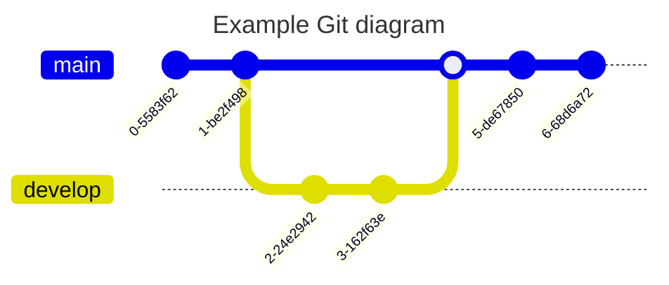

# readmeMermaid
This repository show how we can created a readme file with some diagrams using mermaid
You can find a helpfull guide on https://wordpress.com/post/fernandomirandadomeneghetti.wordpress.com/319

1 - Sequence diagram

2 - Class diagram

3 - State diagrama

4 - Entity Relationship diagrama

5 - Git graph diagrama

