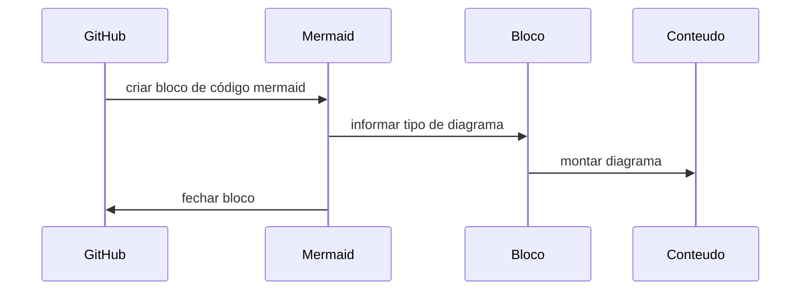

# readmeMermaid
This repository show how we can created a readme file with mermaid diagrams

1 - Sequence diagram

```mermaid
sequenceDiagram
GitHub ->> Mermaid: criar bloco de código mermaid
Mermaid ->> Bloco: informar tipo de diagrama
Bloco ->> Conteudo: montar diagrama
Mermaid ->> GitHub: fechar bloco
```
